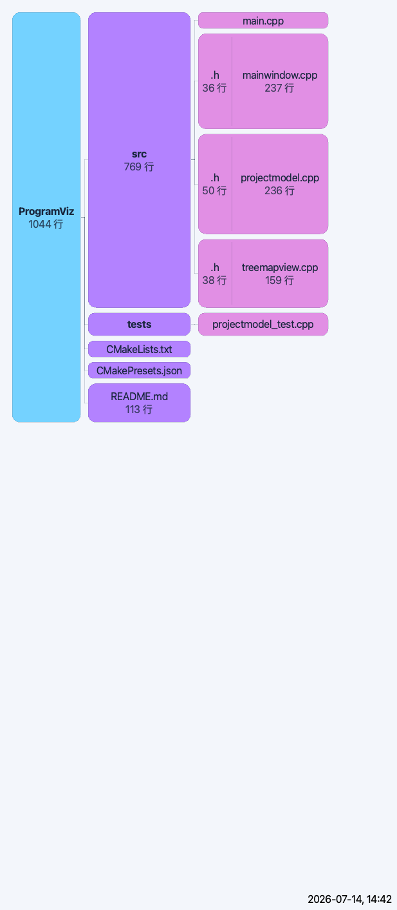

# ProgramViz

[](https://github.com/CCCirclekkko/ProgramViz/actions/workflows/ci.yml)

当前版本：`v0.1.0`（macOS）

ProgramViz 是一个基于 Qt 6 的轻量工程代码结构可视化工具。它扫描用户选择的工程目录，将文件树、目录层级和有效代码行数汇总为从左到右展开的树状图，帮助快速定位工程中体量较大的模块和文件。对于 Git 工程，还可以查看分支与历史版本，并导出演进 GIF。



## 功能

- 递归扫描工程目录，识别常见的 C/C++、Qt、Python、JavaScript/TypeScript、JSON、XML、Markdown 等源代码文件。
- 按文件树展示工程结构，并汇总总行数、有效代码行数、空行、注释行和文件大小。
- 支持节点悬停高亮、折叠/展开、详情查看、路径复制，以及在 Finder 或 VS Code 中打开。
- 支持浅色、深色和跟随系统主题；可调整字号、HSI 配色、列间距、同级间距和节点最小高度。
- 支持最近工程目录、Git 分支/历史版本、JPG 工程结构图和 Git 演进 GIF 导出。
- GIF/JPG 导出支持可选的黑色日期标记、可保存的导出设置、自定义分辨率和 Git 历史阶段进度显示。
- 时间标记支持秒、分、时、日、月、年六种颗粒度，并可通过 CLI 的 `--gif-time-granularity` 配置。

## 安装与使用

macOS 安装包可从 [Releases](https://github.com/CCCirclekkko/ProgramViz/releases) 获取。当前仅提供 macOS 版本，安装包已包含运行所需的 Qt 库。

也可以从源码构建。建议使用 Qt 6.8 或更高版本、CMake 3.21 或更高版本和 Ninja：

```sh
cmake --preset debug
cmake --build --preset debug
open build/debug/ProgramViz.app
```

启动后选择工程根目录，或直接把目录路径作为命令行参数传入。点击节点可查看详情；使用“适应窗口”和“展开所有名称”可以调整可视化布局。Git 工程可从“Git 分支”和“Git 历史”菜单切换数据版本；从“导出”菜单可以导出 JPG 或 Git 演进 GIF。导出 GIF 还需要系统中可执行的 `ffmpeg`。

开发、调试、测试和命令行自动化说明见 [README_DEV.md](doc/README_DEV.md)，开发路线和待办事项见 [PROGRESS.md](doc/PROGRESS.md)。分支、版本、CI 和发布流程见 [WORKFLOW.md](doc/WORKFLOW.md)；发布前检查见 [RELEASE_CHECKLIST.md](doc/RELEASE_CHECKLIST.md) 和 [STABILITY_PORTABILITY_REVIEW.md](doc/STABILITY_PORTABILITY_REVIEW.md)；贡献代码请阅读 [CONTRIBUTING.md](CONTRIBUTING.md)。

## 许可

ProgramViz 自身代码采用 [Apache License 2.0](LICENSE) 发布。

ProgramViz 使用 Qt 6。发布包中的 Qt 组件按照其适用的开源许可证分发，相关版权和许可证信息见 [THIRD_PARTY_NOTICES.md](THIRD_PARTY_NOTICES.md)。导出 Git 演进 GIF 时需要用户自行安装 `ffmpeg`；该工具不随 ProgramViz 安装包发布。
